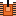

# Tank 1990 Online

<p align="center">
  
</p>


<p align="center">
  
  &nbsp;&nbsp;
  
</p>

Trò chơi xe tăng kiểu Battle City (Tank 1990) hỗ trợ chơi đơn chống AI
hoặc PvP 2 người qua mạng LAN/Online. Kiến trúc peer-to-peer
(NetworkPeer.vb), Host điều phối toàn bộ logic game và đồng bộ trạng thái
đến Client.

# Các tính năng chính
- **Chế độ PvAI**: 1 người chơi tiêu diệt 10 xe địch để thắng
- **Chế độ PvP LAN**: 2 người chơi bắn nhau, phá căn cứ đối thủ để thắng
- Bản đồ ngẫu nhiên mỗi ván: gạch, thép, nước, cỏ, băng
- **Boss** xuất hiện mỗi 5 xe địch (3 máu), **Trùm cuối** (xe thứ 10, 5 máu)
- Tối đa 3 xe địch cùng lúc trên sân, spawn mỗi ~5 giây
- 5 loại powerup rơi ngẫu nhiên khi tiêu diệt xe địch
- Nâng cấp xe tăng qua 3 cấp độ vũ khí

# Địa hình bản đồ
| Địa hình | Tính chất |
|----------|-----------|
| 🟫 Gạch | Bị phá bởi đạn thường và đạn thép |
| ⬜ Thép | Chỉ bị phá bởi đạn cấp 1+ (pha được thép) |
| 🟦 Nước | Không thể đi qua, đạn xuyên qua |
| 🌿 Cỏ | Ẩn xe tăng, đạn xuyên qua, có thể đi qua |
| 🧊 Băng | Có thể đi qua, đạn xuyên qua |
| 🦅 Đại bàng | Căn cứ — bị bắn trúng là thua ngay |

# Powerup
| Powerup | Hiệu ứng | Thời gian |
|---------|----------|-----------|
| ⭐ Ngôi sao | Nâng cấp vũ khí lên 1 cấp (tối đa cấp 2) | Vĩnh viễn |
| ⛑️ Mũ bảo hộ | Bất tử tạm thời | ~9.6 giây |
| 💣 Lựu đạn | Tiêu diệt toàn bộ xe địch đang có trên sân | Tức thì |
| 🔧 Xẻng | Bọc thép quanh căn cứ tạm thời | ~24 giây |
| 🕐 Đồng hồ | Đóng băng toàn bộ xe địch | ~7.2 giây |

> Powerup có thể rơi ngẫu nhiên (30%) khi tiêu diệt xe địch, tự biến mất
> sau ~18 giây nếu không được nhặt.

# Cấp độ vũ khí
| Cấp | Tên | Khả năng |
|-----|-----|----------|
| 0 | Mặc định | 1 viên/lần, chỉ phá gạch |
| 1 | Đạn thép | 1 viên/lần, phá được cả thép |
| 2 | Song phi | 2 viên cùng lúc, phá được cả thép |

# Điều kiện thắng
**PvAI:**
- Tiêu diệt đủ 10 xe địch → **Thắng**
- Căn cứ (Đại bàng) bị phá hủy → **Thua**
- Xe tăng bị bắn trúng → **Thua**

**PvP:**
- Phá hủy căn cứ của đối thủ → **Thắng**
- Xe tăng đối thủ bị tiêu diệt → **Thắng**
- Căn cứ của mình bị phá → **Thua**

# Điều khiển
| Hành động | Player 1 (Host) | Player 2 (Client) |
|-----------|-----------------|-------------------|
| Di chuyển | W A S D | ↑ ↓ ← → |
| Bắn | Space | Enter |

# Cách build
Yêu cầu: **.NET Framework 4.x** đã cài sẵn trên Windows.

```
build_tank1990.bat
```

File `.exe` xuất ra cùng thư mục với tên `Tank1990Online.exe`.

> Đặt thư mục `sprites/` cạnh file `.exe` để hiển thị sprite xe tăng,
> địa hình và powerup. Game vẫn chạy nếu thiếu — tự vẽ hình khối thay thế.

# Cách chơi

**PvAI:**
1. Chọn **Chơi PvAI** → bắt đầu ngay
2. Dùng WASD di chuyển, Space bắn
3. Tiêu diệt 10 xe địch, bảo vệ Đại bàng để thắng

**PvP LAN:**
1. Máy Host chọn **Tạo phòng** → chờ kết nối
2. Máy Client chọn **Vào phòng** → nhập IP của Host → kết nối
3. Phá căn cứ hoặc tiêu diệt xe tăng đối thủ để thắng

# Cấu trúc file
| File | Vai trò |
|------|---------|
| `TankGame.vb` | Logic game: bản đồ, di chuyển, đạn, xe địch AI, Boss, powerup, thắng thua |
| `Form1.vb` | Giao diện, vẽ bản đồ, sprite, điều khiển, kết nối mạng |
| `NetworkPeer.vb` | Kết nối mạng TCP giữa Host và Client |
| `Program.vb` | Entry point |
| `build_tank1990.bat` | Script build bằng vbc.exe |
| `sprites/` | Sprite xe tăng, địa hình, powerup, đạn |
